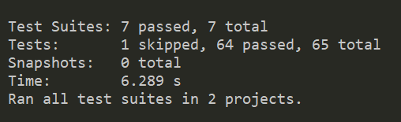

  <a href="#rocket-tecnologias">Tecnologias</a>&nbsp;&nbsp;&nbsp;|&nbsp;&nbsp;&nbsp;
  <a href="#-projeto">Projeto</a>&nbsp;&nbsp;&nbsp;|&nbsp;&nbsp;&nbsp;
  <a href="#-como-rodar">Como rodar</a>&nbsp;&nbsp;&nbsp;|&nbsp;&nbsp;&nbsp;
  <a href="#-como-contribuir">Como contribuir</a>&nbsp;&nbsp;&nbsp;
  

 

# Spotify Radio

## 🚀 Tecnologias

Esse projeto foi desenvolvido com as seguintes tecnologias:

- [JavaScript](https://developer.mozilla.org/pt-BR/docs/Web/JavaScript) 
- [HTML5](https://developer.mozilla.org/pt-BR/docs/Web/HTML/HTML5) 
- [CSS3](https://developer.mozilla.org/pt-BR/docs/Web/CSS)
- [Yarn](https://yarnpkg.com/) 
- [NPM](https://www.npmjs.com/) - 8.5.2
- [Docker](https://www.docker.com/) - 20.10.13, build a224086

## 💻 Projeto

Esse projeto simula um pagina e um controlador. A pagina roda o audio e o controlador pode fazer o seguintes comandos:
- Start - tocar o audio
- Pause - parar o audio
- Applause - add aplauso no audio
- Audience Applause - add aplausos no audio
- Boo! - add vaias no audio
- Fart - add peido no audio
- Laughing - add risadas no audio

Pagina principal - http://localhost:3000/home
Controles - http://localhost:3000/controller

Porjeto desenvolvido durante a Semana JS Expert 7 pelo canal [Erick Wendel](https://www.youtube.com/channel/UCh84012dEUE076wM2CVFN9A)

  

Cobertura de teste no codigo

  

Testes

  

[Projeto original](https://github.com/ErickWendel/semana-javascript-expert06)

## 🚀 Como Rodar

- Clone o projeto.
- Entre na pasta do projeto e rode "npm ci --silen".
- Para rodar o projeto "npm run live-reload:docker".
- Para rodar o test "npm run test:docker".
- Para rodar o coverage "npm run test:coverage:docker".

## 🤔 Como contribuir

- Faça um fork desse repositório;
- Cria uma branch com a sua feature: `git checkout -b minha-feature`;
- Faça commit das suas alterações: `git commit -m 'feat: Minha nova feature'`;
- Faça push para a sua branch: `git push origin minha-feature`.

Depois que o merge da sua pull request for feito, você pode deletar a sua branch.

## 📝 Licença

Esse projeto está sob a licença MIT.
